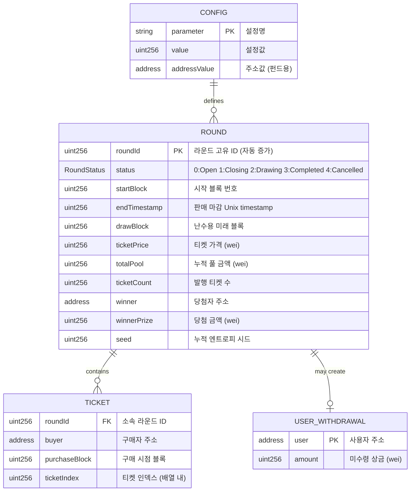

# MetaLotto 스마트 컨트랙트 ERD

## 1. 개요

MetaLotto는 블록체인 DApp이므로, 전통적인 RDB ERD 대신 스마트 컨트랙트의 상태 변수 구조를 ERD 형식으로 문서화합니다.

### 컨트랙트 상속 구조

```
MetaLotto
├── Ownable (OpenZeppelin v5) — Owner 권한 관리
├── Pausable (OpenZeppelin v5) — 비상 정지 기능
└── ReentrancyGuard (OpenZeppelin v5) — 재진입 방지
```

---

## 2. Mermaid ERD 다이어그램



---

## 3. 엔티티 상세 정의

### 3.1 Round (라운드)

| 필드 | 타입 | 제약조건 | 설명 |
|------|------|----------|------|
| `roundId` | `uint256` | PK, Auto-increment | 라운드 고유 ID |
| `status` | `RoundStatus (enum)` | NOT NULL | 라운드 상태 |
| `startBlock` | `uint256` | NOT NULL | 시작 블록 번호 |
| `endTimestamp` | `uint256` | NOT NULL | 판매 마감 시각 (Unix timestamp) |
| `drawBlock` | `uint256` | NULL (Closing 시 설정) | 난수 생성용 미래 블록 |
| `ticketPrice` | `uint256` | NOT NULL | 티켓 가격 (wei) |
| `totalPool` | `uint256` | DEFAULT 0 | 누적 풀 금액 (wei) |
| `ticketCount` | `uint256` | DEFAULT 0 | 발행된 총 티켓 수 |
| `winner` | `address` | NULL (추첨 후 설정) | 당첨자 주소 |
| `winnerPrize` | `uint256` | DEFAULT 0 | 당첨 금액 (wei) |
| `seed` | `uint256` | DEFAULT 0 | 누적 엔트로피 시드 |

#### RoundStatus Enum

```solidity
enum RoundStatus {
    Open,       // 0: 티켓 판매 중
    Closing,    // 1: 판매 종료, 미래 블록 대기 중
    Drawing,    // 2: 당첨자 선정 가능 (미사용)
    Completed,  // 3: 상금 분배 완료
    Cancelled   // 4: 라운드 취소 (참여자 < 최소인원)
}
```

#### 매핑 선언

```solidity
mapping(uint256 => Round) public rounds;
```

#### 관련 기능

| 기능 ID | 기능명 | 관련 필드 |
|---------|--------|-----------|
| F-01 | 라운드 관리 | 전체 필드 |
| F-02 | 난수 생성 | `seed`, `drawBlock` |
| F-03 | 티켓 구매 | `totalPool`, `ticketCount`, `seed` |
| F-04 | 상금 분배 | `winner`, `winnerPrize`, `totalPool` |
| F-05 | 자동 지급 | `winner`, `winnerPrize` |
| F-07 | 이벤트 로그 | 전체 필드 |
| F-08 | 비상 정지 | `status` 전이 차단 |

---

### 3.2 Ticket (티켓)

| 필드 | 타입 | 제약조건 | 설명 |
|------|------|----------|------|
| `roundId` | `uint256` | FK → Round.roundId | 소속 라운드 ID |
| `buyer` | `address` | NOT NULL | 구매자 주소 |
| `purchaseBlock` | `uint256` | NOT NULL | 구매 시점 블록 번호 |
| `ticketIndex` | `uint256` | 암시적 (배열 인덱스) | 티켓 인덱스 |

#### 매핑 선언

```solidity
// 라운드별 티켓 배열
mapping(uint256 => Ticket[]) internal roundTickets;

// 사용자별 티켓 인덱스 (조회용)
mapping(uint256 => mapping(address => uint256[])) internal userTicketIndices;
```

#### 관계

- `Round (1) : Ticket (N)` — 하나의 라운드는 여러 티켓을 포함
- `Ticket`은 `roundTickets[roundId]` 배열에 순차 저장
- `userTicketIndices[roundId][buyer]`로 사용자 티켓 인덱스 조회

#### 관련 기능

| 기능 ID | 기능명 | 관련 필드 |
|---------|--------|-----------|
| F-03 | 티켓 구매 | 전체 필드 |
| F-02 | 난수 생성 | `ticketIndex` (당첨자 선정) |

---

### 3.3 UserWithdrawal (미수령 상금)

| 필드 | 타입 | 제약조건 | 설명 |
|------|------|----------|------|
| `user` | `address` | PK | 사용자 주소 |
| `amount` | `uint256` | DEFAULT 0 | 미수령 상금 총액 (wei) |

#### 매핑 선언

```solidity
mapping(address => uint256) public pendingWithdrawals;
```

#### 용도

- 당첨금 송금 실패 시 Pull Pattern으로 저장
- 여러 라운드에서 실패한 금액 누적 가능
- `withdrawPending()`으로 일괄 인출

#### 관련 기능

| 기능 ID | 기능명 | 관련 필드 |
|---------|--------|-----------|
| F-04 | 상금 분배 | `amount` (실패 시 증가) |
| F-05 | 자동 지급 | 전체 필드 |

---

### 3.4 Config (설정값)

전역 설정값은 상태 변수로 직접 저장됩니다.

#### 스칼라 변수 (uint256)

| 변수명 | 타입 | 기본값 | 설명 | 변경 가능 |
|--------|------|--------|------|-----------|
| `currentRoundId` | `uint256` | 1 (배포 시) | 현재 활성 라운드 ID | X (자동 관리) |
| `ticketPrice` | `uint256` | 100 * 1e18 | 티켓 가격 (wei) | O (Owner) |
| `roundDuration` | `uint256` | 21600 | 라운드 기간 (초, 6시간) | O (Owner) |
| `drawDelay` | `uint256` | 10 | 추첨용 블록 지연 수 | O (Owner) |
| `minTicketsPerRound` | `uint256` | 2 | 라운드 최소 티켓 수 | O (Owner) |

#### 주소 변수 (address)

| 변수명 | 타입 | 설명 | 변경 가능 |
|--------|------|------|-----------|
| `communityFund` | `address` | 커뮤니티 펀드 주소 (5% 수령) | O (Owner) |
| `operationFund` | `address` | 운영 지갑 주소 (5% 수령) | O (Owner) |

#### 상수 (immutable)

```solidity
uint256 public constant WINNER_SHARE = 9000;      // 90% (basis points)
uint256 public constant COMMUNITY_SHARE = 500;    // 5% (basis points)
uint256 public constant OPERATION_SHARE = 500;    // 5% (basis points)
uint256 public constant BASIS_POINTS = 10000;     // 100%
uint256 public constant MAX_TICKETS_PER_PURCHASE = 100; // 1회 최대 구매 수
```

#### 관련 기능

| 기능 ID | 기능명 | 관련 변수 |
|---------|--------|-----------|
| F-01 | 라운드 관리 | `roundDuration`, `drawDelay`, `minTicketsPerRound` |
| F-03 | 티켓 구매 | `ticketPrice`, `MAX_TICKETS_PER_PURCHASE` |
| F-04 | 상금 분배 | `WINNER_SHARE`, `COMMUNITY_SHARE`, `OPERATION_SHARE`, `communityFund`, `operationFund` |
| F-08 | 비상 정지 | `_paused` (Pausable 내부) |

---

## 4. 매핑 관계 요약

### 4.1 전체 매핑 구조

```solidity
// === 라운드 관련 ===
mapping(uint256 => Round) public rounds;                    // roundId → Round
uint256 public currentRoundId;                              // 현재 라운드 ID

// === 티켓 관련 ===
mapping(uint256 => Ticket[]) internal roundTickets;         // roundId → Ticket[]
mapping(uint256 => mapping(address => uint256[])) internal userTicketIndices; // roundId → user → ticketIndices[]

// === 지급 관련 ===
mapping(address => uint256) public pendingWithdrawals;      // user → amount

// === 설정값 ===
uint256 public ticketPrice;
uint256 public roundDuration;
uint256 public drawDelay;
uint256 public minTicketsPerRound;
address public communityFund;
address public operationFund;

// === OpenZeppelin 상태 ===
bool private _paused;  // Pausable 내부
address private _owner; // Ownable 내부
```

### 4.2 관계도

```
┌─────────────────────────────────────────────────────────────────┐
│                        rounds (mapping)                          │
│  ┌───────┐  ┌───────┐  ┌───────┐  ┌───────┐                    │
│  │ ID: 1 │  │ ID: 2 │  │ ID: 3 │  │  ...  │                    │
│  └───┬───┘  └───────┘  └───────┘  └───────┘                    │
│      │                                                           │
│      │ roundTickets[1]                                           │
│      ▼                                                           │
│  ┌───────────────────────────────────────────────┐              │
│  │ Ticket[0] │ Ticket[1] │ Ticket[2] │ ... │ Ticket[N] │        │
│  │ buyer: A  │ buyer: B  │ buyer: A  │     │ buyer: Z  │        │
│  └───────────────────────────────────────────────┘              │
│                          │                                       │
│                          │ userTicketIndices[1][A]               │
│                          ▼                                       │
│                     [0, 2, ...]                                  │
└─────────────────────────────────────────────────────────────────┘

┌─────────────────────────────────────────────────────────────────┐
│                  pendingWithdrawals (mapping)                    │
│  ┌─────────────┐  ┌─────────────┐  ┌─────────────┐              │
│  │ user: A     │  │ user: B     │  │ user: C     │              │
│  │ amount: 900 │  │ amount: 0   │  │ amount: 450 │              │
│  └─────────────┘  └─────────────┘  └─────────────┘              │
└─────────────────────────────────────────────────────────────────┘
```

---

## 5. 기능별 데이터 접근 패턴

### 5.1 F-01: 라운드 관리

| 작업 | 접근 매핑 | 패턴 |
|------|-----------|------|
| 라운드 생성 | `rounds[currentRoundId++]` | Write |
| 라운드 조회 | `rounds[roundId]` | Read |
| 상태 전이 | `round.status = ...` | Write |

### 5.2 F-02: 난수 생성

| 작업 | 접근 매핑 | 패턴 |
|------|-----------|------|
| Seed 누적 | `rounds[roundId].seed` | Read-Modify-Write |
| 당첨자 선정 | `roundTickets[roundId][winnerIndex]` | Read |

### 5.3 F-03: 티켓 구매

| 작업 | 접근 매핑 | 패턴 |
|------|-----------|------|
| 티켓 발급 | `roundTickets[roundId].push()` | Write (Append) |
| 사용자 인덱스 | `userTicketIndices[roundId][buyer].push()` | Write (Append) |
| 풀 업데이트 | `rounds[roundId].totalPool += cost` | Read-Modify-Write |

### 5.4 F-04: 상금 분배

| 작업 | 접근 매핑 | 패턴 |
|------|-----------|------|
| 풀 조회 | `rounds[roundId].totalPool` | Read |
| 당첨자 저장 | `rounds[roundId].winner = ...` | Write |
| 송금 실패 시 | `pendingWithdrawals[winner] += ...` | Read-Modify-Write |

### 5.5 F-05: 자동 상금 지급

| 작업 | 접근 매핑 | 패턴 |
|------|-----------|------|
| 미수령금 조회 | `pendingWithdrawals[user]` | Read |
| 인출 처리 | `pendingWithdrawals[user] = 0` | Write |

### 5.6 F-07: 이벤트 로그

이벤트는 상태 변수가 아닌 트랜잭션 로그에 저장됩니다.

| 이벤트 | indexed 필드 | 용도 |
|--------|-------------|------|
| `RoundStarted` | roundId | 라운드 시작 |
| `TicketPurchased` | roundId, buyer | 티켓 구매 |
| `RoundClosing` | roundId | 라운드 종료 |
| `WinnerDrawn` | roundId, winner | 당첨자 발표 |
| `RoundCancelled` | roundId | 라운드 취소 |
| `RefundClaimed` | roundId, buyer | 환불 완료 |
| `PrizeTransferSuccess` | winner | 송금 성공 |
| `PrizeTransferFailed` | winner | 송금 실패 |
| `WithdrawalClaimed` | user | 인출 완료 |
| `ConfigUpdated` | - | 설정 변경 |
| `FundAddressUpdated` | - | 펀드 주소 변경 |
| `Paused` | - | 일시 정지 |
| `Unpaused` | - | 재개 |

### 5.7 F-08: 비상 정지

| 작업 | 접근 변수 | 패턴 |
|------|-----------|------|
| 상태 확인 | `_paused` | Read |
| 일시 정지 | `_paused = true` | Write |
| 재개 | `_paused = false` | Write |

---

## 6. 가스 최적화 인덱싱 전략

### 6.1 Storage Slot 배치

Solidity는 32바이트 슬롯에 연속된 변수를 패킹합니다.

```solidity
// 최적화 전 (3개 슬롯)
uint256 a;     // slot 0
uint256 b;     // slot 1
address c;     // slot 2 (32바이트 중 20바이트 사용)

// 최적화 후 (2개 슬롯)
uint256 a;     // slot 0
address c;     // slot 1 (상위 20바이트)
uint128 b1;    // slot 1 (하위 16바이트)
uint128 b2;    // slot 1 (그 다음 16바이트)
```

### 6.2 Round Struct 패킹

```solidity
struct Round {
    // Slot 0
    uint256 roundId;          // 32 bytes
    // Slot 1
    uint256 startBlock;       // 32 bytes
    // Slot 2
    uint256 endTimestamp;     // 32 bytes
    // Slot 3
    uint256 drawBlock;        // 32 bytes
    // Slot 4
    uint256 ticketPrice;      // 32 bytes
    // Slot 5
    uint256 totalPool;        // 32 bytes
    // Slot 6
    uint256 ticketCount;      // 32 bytes
    // Slot 7
    uint256 winnerPrize;      // 32 bytes
    // Slot 8
    uint256 seed;             // 32 bytes
    // Slot 9 (패킹 가능)
    RoundStatus status;       // 1 byte
    address winner;           // 20 bytes
    // 패딩: 11 bytes
}
```

### 6.3 조회 패턴 최적화

| 조회 유형 | 사용 매핑 | 시간 복잡도 |
|-----------|-----------|-------------|
| 라운드별 티켓 수 | `roundTickets[roundId].length` | O(1) |
| 사용자별 티켓 수 | `userTicketIndices[roundId][user].length` | O(1) |
| 특정 티켓 구매자 | `roundTickets[roundId][index].buyer` | O(1) |
| 사용자 미수령금 | `pendingWithdrawals[user]` | O(1) |

---

## 7. 기능 커버리지 매트릭스

| 기능 ID | Round | Ticket | UserWithdrawal | Config |
|---------|:-----:|:------:|:--------------:|:------:|
| F-01 라운드 관리 | ✓ | | | ✓ |
| F-02 난수 생성 | ✓ | ✓ | | |
| F-03 티켓 구매 | ✓ | ✓ | | ✓ |
| F-04 상금 분배 | ✓ | | ✓ | ✓ |
| F-05 자동 지급 | | | ✓ | |
| F-06 웹 프론트엔드 | ✓ | ✓ | ✓ | ✓ |
| F-07 이벤트 로그 | ✓ | ✓ | ✓ | ✓ |
| F-08 비상 정지 | ✓ | | | ✓ |

---

## 8. v2 확장 고려사항

### 8.1 잠재적 새 엔티티

| 엔티티 | 용도 | 예상 필드 |
|--------|------|-----------|
| `VRFRequest` | Chainlink VRF 요청 | `roundId`, `requestId`, `fulfilled` |
| `UserRole` | 권한 관리 | `user`, `role` (PAUSER, ADMIN) |

### 8.2 인덱스 추가

| 인덱스 | 용도 |
|--------|------|
| `winnerHistory[roundId]` | 당첨자 히스토리 빠른 조회 |
| `userTotalTickets[user]` | 사용자 전체 티켓 수 |

---

## 변경 이력

| 날짜 | 변경 내용 | 이유 |
|------|----------|------|
| 2026-03-13 | 초기 작성 | /design 스킬 실행 |
