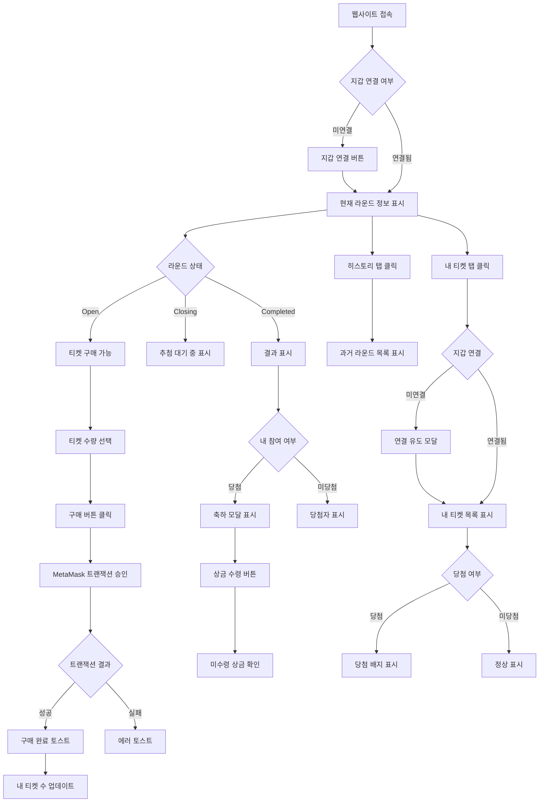
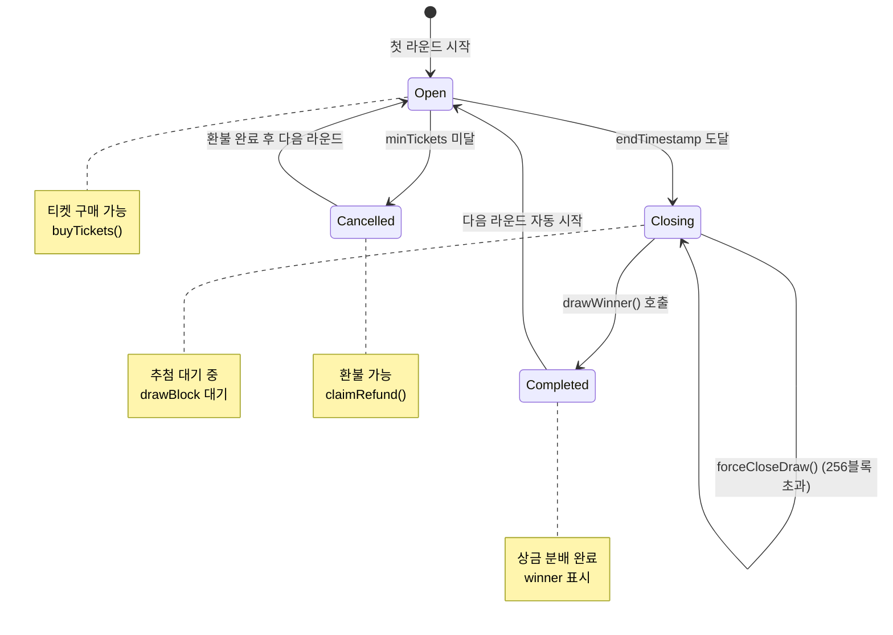

# MetaLotto — 네비게이션 설계서

## 1. 화면 목록

| 화면명 | 경로 | 설명 | 지갑 연결 필요 | 라운드 상태 |
|--------|------|------|----------------|-------------|
| 홈 (현재 라운드) | `/` | 현재 라운드 상태, 티켓 구매, 카운트다운 | 선택적 (구매 시 필수) | 모든 상태 |
| 라운드 상세 | `/rounds/[roundId]` | 특정 라운드 상세 정보 | 선택적 (구매 시 필수) | 모든 상태 |
| 히스토리 | `/history` | 과거 라운드 결과, 당첨자 목록 | 불필요 | Completed |
| 내 티켓 | `/my-tickets` | 내 참여 내역, 환불, 미수령 상금 | 필수 | 모든 상태 |
| 당첨 알림 | `/my-tickets?won=true` | 당첨 내역 상세 | 필수 | Completed |

---

## 2. URL 구조

### 2.1 정적 라우트

```typescript
/                    // 홈 (현재 라운드)
/history              // 히스토리
/my-tickets           // 내 티켓
```

### 2.2 동적 라우트

```typescript
/rounds/[roundId]    // 특정 라운드 상세
```

### 2.3 쿼리 파라미터

```typescript
?won=true             // 당첨 내역 필터 (내 티켓)
?status=open          // 라운드 상태 필터
?page=1               // 페이지네이션
```

---

## 3. 화면 흐름도 (Mermaid)

### 3.1 사용자 여정



### 3.2 라운드 상태 전환 흐름



### 3.3 라우트 전환 흐름

```mermaid
graph LR
    subgraph "Public Routes"
        A[/] --> B[/history]
        B --> A
    end

    subgraph "Protected Routes"
        C[/my-tickets]
        D[/rounds/[roundId]]
    end

    A --> C
    A --> D
    B --> C
    B --> D

    subgraph "Auth Check"
        E{지갑 연결?}
        E -->|예| C
        E -->|아니오| F[연결 모달]
        F --> C
    end

    C --> E
    D --> E
```

---

## 4. 네비게이션 요소

### 4.1 Header 구조 (Desktop)

```typescript
┌─────────────────────────────────────────────────────────────────────────────┐
│  MetaLotto Logo                    Round #1234       [Connect Wallet]      │
│                                      Open                                    │
│                        ┌─────────────────────────────────────┐               │
│                        │  Navigation Tabs                   │               │
│                        │  [Home] [History] [My Tickets]     │               │
│                        └─────────────────────────────────────┘               │
└─────────────────────────────────────────────────────────────────────────────┘
```

**Header 컴포넌트:**

| 요소 | 위치 | 설명 |
|------|------|------|
| Logo | 왼쪽 | MetaLotto 브랜딩 + 홈으로 이동 |
| 현재 라운드 정보 | 중앙 | 라운드 ID + 상태 배지 |
| 지갑 연결 버튼 | 오른쪽 | Connect Wallet / 지갑 주소 표시 |
| 네비게이션 탭 | 하단 | Home / History / My Tickets |

### 4.2 Header 구조 (Mobile)

```typescript
┌─────────────────────────────────────┐
│  MetaLotto            [Menu]        │
│                                      │
│  Round #1234   Open                 │
│  ─────────────────────────────────  │
│                                      │
│  [Home] [History] [My Tickets]      │
└─────────────────────────────────────┘
```

**Mobile 네비게이션:**

| 요소 | 위치 | 설명 |
|------|------|------|
| Logo | 왼쪽 | MetaLotto 브랜딩 |
| 메뉴 버튼 | 오른쪽 | 햄버거 메뉴 (사이드바) |
| 현재 라운드 정보 | 중앙 | 라운드 ID + 상태 배지 |
| 하단 탭 바 | 하단 | Home / History / My Tickets (아이콘 + 텍스트) |

### 4.3 네비게이션 탭

| 탭 | 경로 | 아이콘 | 설명 |
|----|------|--------|------|
| Home | `/` | 🏠 | 현재 라운드 + 티켓 구매 |
| History | `/history` | 📜 | 과거 라운드 결과 |
| My Tickets | `/my-tickets` | 🎟️ | 내 참여 내역 |

---

## 5. 보호된 라우트

### 5.1 인증 필요 화면

| 경로 | 인증 유형 | 미인증 시 동작 |
|------|-----------|----------------|
| `/my-tickets` | 지갑 연결 필수 | 연결 유도 모달 표시 후 연결 시 리다이렉트 |
| `/my-tickets?won=true` | 지갑 연결 필수 | 연결 유도 모달 표시 후 연결 시 리다이렉트 |

### 5.2 인증 불필요 화면

| 경로 | 설명 |
|------|------|
| `/` | 현재 라운드 정보는 조회 가능 (지갑 연결 시 추가 정보 표시) |
| `/history` | 과거 결과는 누구나 조회 가능 |
| `/rounds/[roundId]` | 특정 라운드 상세는 누구나 조회 가능 |

### 5.3 라우트 가드 구현

```typescript
// frontend/src/components/layout/PrivateRoute.tsx
'use client'

import { useAccount } from 'wagmi'
import { useRouter } from 'next/navigation'
import { useEffect } from 'react'

interface PrivateRouteProps {
  children: React.ReactNode
}

export function PrivateRoute({ children }: PrivateRouteProps) {
  const { isConnected, address } = useAccount()
  const router = useRouter()

  useEffect(() => {
    if (!isConnected) {
      // 연결 유도 모달 표시
      router.push('/')
    }
  }, [isConnected, router])

  if (!isConnected) {
    return null // 또는 로딩 스피너
  }

  return <>{children}</>
}
```

---

## 6. 모바일 네비게이션

### 6.1 하단 탭 바 (Bottom Tab Bar)

```typescript
┌─────────────────────────────────────┐
│                                     │
│  Main Content Area                  │
│                                     │
├─────────────────────────────────────┤
│  [🏠] [📜] [🎟️]                   │
│ Home History My Tickets             │
└─────────────────────────────────────┘
```

### 6.2 햄버거 메뉴 (Hamburger Menu)

```typescript
┌─────────────────────────────────────┐
│  MetaLotto                  [☰]    │
└─────────────────────────────────────┘
         ↓ 클릭
┌─────────────────────────────────────┐
│  [X]                                │
│                                     │
│  🏠 Home                            │
│  📜 History                         │
│  🎟️ My Tickets                      │
│                                     │
│  ⚙️ Settings                        │
│                                     │
│  💬 Support                         │
└─────────────────────────────────────┘
```

### 6.3 모바일 반응형 브레이크포인트

| 화면 크기 | 네비게이션 스타일 |
|-----------|------------------|
| < 768px | 하단 탭 바 |
| >= 768px | Header 탭 |

---

## 7. 화면별 상세 명세

### 7.1 홈 (현재 라운드) - `/`

#### 7.1.1 레이아웃

```typescript
// Desktop
┌─────────────────────────────────────────────────────────────────────────────┐
│  Header (Logo | Current Round | Connect Wallet)                              │
├─────────────────────────────────────────────────────────────────────────────┤
│                                                                              │
│  ┌─────────────────────────────────────────────────────────────────────┐   │
│  │                           Current Round                             │   │
│  │                                                                     │   │
│  │  Round #1234                        Status: [OPEN]                  │   │
│  │  ────────────────────────────────────────────────────────────     │   │
│  │                                                                     │   │
│  │  ⏱️  Time Remaining:  03:45:32                                     │   │
│  │  🎫 Tickets Sold:    45/100                                        │   │
│  │  💰 Pool Size:       4,500 META                                   │   │
│  │  💵 Ticket Price:    100 META                                      │   │
│  │                                                                     │   │
│  │  ┌─────────────────────────────────────────────────────────────┐   │   │
│  │  │  Ticket Purchase                                           │   │   │
│  │  │                                                             │   │   │
│  │  │  Quantity:  [−]   5   [+]     (1-100)                       │   │   │
│  │  │                                                             │   │   │
│  │  │  Total Cost:  500 META                                      │   │   │
│  │  │                                                             │   │   │
│  │  │  [  Buy Tickets  ]  (지갑 연결 필요)                        │   │   │
│  │  └─────────────────────────────────────────────────────────────┘   │   │
│  └─────────────────────────────────────────────────────────────────────┘   │
│                                                                              │
│  ┌─────────────────────────────────────────────────────────────────────┐   │
│  │                         Recent Activity                             │   │
│  │  [View All →]                                                        │   │
│  │                                                                     │   │
│  │  • 0x1234...abcd bought 5 tickets                                  │   │
│  │  • 0x5678...efgh bought 3 tickets                                  │   │
│  │  • 0xabcd...1234 bought 2 tickets                                  │   │
│  └─────────────────────────────────────────────────────────────────────┘   │
│                                                                              │
└─────────────────────────────────────────────────────────────────────────────┘
```

#### 7.1.2 상태별 UI

| 라운드 상태 | 카운트다운 | 구매 버튼 | 추가 정보 |
|-----------|-----------|-----------|-----------|
| Open | 남은 시간 표시 | 활성화 | 티켓 수, 풀 규모 |
| Closing | "추첨 대기 중" 메시지 | 비활성화 | drawBlock 대기 |
| Completed | 라운드 완료 메시지 | 비활성화 | 당첨자, 당첨금액 |
| Cancelled | 라운드 취소 메시지 | 비활성화 | 환불 안내 |

#### 7.1.3 인터랙션

| 액션 | 결과 |
|------|------|
| 지갑 연결 버튼 클릭 | MetaMask 연결 요청 → 연결 성공 시 주소 표시 |
| 티켓 수량 변경 | Total Cost 실시간 계산 |
| 구매 버튼 클릭 (미연결) | 연결 유도 모달 |
| 구매 버튼 클릭 (연결됨) | MetaMask 트랜잭션 → 성공 시 토스트 |
| Recent Activity "View All" 클릭 | `/my-tickets`로 이동 |

---

### 7.2 라운드 상세 - `/rounds/[roundId]`

#### 7.2.1 레이아웃

```typescript
┌─────────────────────────────────────────────────────────────────────────────┐
│  [< Back to Home]          Round #1234                                    │
├─────────────────────────────────────────────────────────────────────────────┤
│                                                                              │
│  ┌─────────────────────────────────────────────────────────────────────┐   │
│  │                           Round Details                              │   │
│  │                                                                     │   │
│  │  Round ID:          1234                                            │   │
│  │  Status:            [COMPLETED]                                     │   │
│  │  Start Block:       #12,345,678                                    │   │
│  │  End Timestamp:     2026-03-13 12:00:00 UTC                         │   │
│  │  Draw Block:        #12,345,690                                     │   │
│  │                                                                     │   │
│  │  Total Pool:        10,000 META                                     │   │
│  │  Total Tickets:     100                                             │   │
│  │  Ticket Price:      100 META                                        │   │
│  └─────────────────────────────────────────────────────────────────────┘   │
│                                                                              │
│  ┌─────────────────────────────────────────────────────────────────────┐   │
│  │                            Winner                                   │   │
│  │                                                                     │   │
│  │  🏆 0xabcd1234...efgh5678                                           │   │
│  │                                                                     │   │
│  │  Prize:        9,000 META (90%)                                    │   │
│  │  Ticket #:     42/100                                             │   │
│  │  Blockhash:    0x8f7d...3a2c                                       │   │
│  └─────────────────────────────────────────────────────────────────────┘   │
│                                                                              │
│  ┌─────────────────────────────────────────────────────────────────────┐   │
│  │                      Prize Distribution                             │   │
│  │                                                                     │   │
│  │  🏆 Winner:        9,000 META  (90%)  [View on Explorer]            │   │
│  │  🌐 Community:     500 META   (5%)   [View on Explorer]             │   │
│  │  ⚙️ Operation:     500 META   (5%)   [View on Explorer]             │   │
│  └─────────────────────────────────────────────────────────────────────┘   │
│                                                                              │
└─────────────────────────────────────────────────────────────────────────────┘
```

#### 7.2.2 상태별 UI

| 라운드 상태 | 당첨자 표시 | 상금 분배 표시 | 추가 요소 |
|-----------|-----------|---------------|-----------|
| Open | 비표시 | 비표시 | 구매 버튼 |
| Closing | 비표시 | 비표시 | drawBlock 남은 수 |
| Completed | 표시 | 표시 | Explorer 링크 |
| Cancelled | 비표시 | 비표시 | 환불 안내 |

---

### 7.3 히스토리 - `/history`

#### 7.3.1 레이아웃

```typescript
┌─────────────────────────────────────────────────────────────────────────────┐
│  Header (Logo | Current Round | Connect Wallet)                              │
│  ───────────────────────────────────────────────────────────────────────────  │
│                                                                              │
│  ┌─────────────────────────────────────────────────────────────────────┐   │
│  │  History: Past Rounds                                               │   │
│  │                                                                     │   │
│  │  Filter: [All ▼]  Search: [______________]                           │   │
│  │                                                                     │   │
│  │  ┌─────────────────────────────────────────────────────────────┐   │   │
│  │  │ Round #1233  [COMPLETED]    2026-03-13 12:00 UTC            │   │   │
│  │  │ ─────────────────────────────────────────────────────────   │   │   │
│  │  │ Total Pool:  10,000 META   Tickets: 100                      │   │   │
│  │  │ Winner:       0xabcd...efgh                                  │   │   │
│  │  │ Prize:        9,000 META                                     │   │   │
│  │  │                                                          [→]  │   │   │
│  │  └─────────────────────────────────────────────────────────────┘   │   │
│  │                                                                     │   │
│  │  ┌─────────────────────────────────────────────────────────────┐   │   │
│  │  │ Round #1232  [COMPLETED]    2026-03-13 06:00 UTC            │   │   │
│  │  │ ─────────────────────────────────────────────────────────   │   │   │
│  │  │ Total Pool:  8,500 META    Tickets: 85                      │   │   │
│  │  │ Winner:       0x5678...abcd                                  │   │   │
│  │  │ Prize:        7,650 META                                     │   │   │
│  │  │                                                          [→]  │   │   │
│  │  └─────────────────────────────────────────────────────────────┘   │   │
│  │                                                                     │   │
│  │  ┌─────────────────────────────────────────────────────────────┐   │   │
│  │  │ Round #1231  [CANCELLED]    2026-03-13 00:00 UTC            │   │   │
│  │  │ ─────────────────────────────────────────────────────────   │   │   │
│  │  │ Total Pool:  500 META     Tickets: 5                         │   │   │
│  │  │ Reason:       Not enough participants                        │   │   │
│  │  │                                                          [→]  │   │   │
│  │  └─────────────────────────────────────────────────────────────┘   │   │
│  │                                                                     │   │
│  │  [Load More]                                                         │   │
│  └─────────────────────────────────────────────────────────────────────┘   │
│                                                                              │
└─────────────────────────────────────────────────────────────────────────────┘
```

#### 7.3.2 필터 옵션

| 필터 | 옵션 | 설명 |
|------|------|------|
| Status | All / Completed / Cancelled | 라운드 상태 필터 |
| Sort | Newest / Oldest | 정렬 순서 |
| Search | 주소 검색 | 당첨자 주소 검색 |

#### 7.3.3 인터랙션

| 액션 | 결과 |
|------|------|
| 라운드 카드 클릭 | `/rounds/[roundId]`로 이동 |
| 필터 변경 | 리스트 실시간 필터링 |
| Load More 클릭 | 다음 페이지 로드 (무한 스크롤) |

---

### 7.4 내 티켓 - `/my-tickets`

#### 7.4.1 레이아웃

```typescript
┌─────────────────────────────────────────────────────────────────────────────┐
│  Header (Logo | Current Round | 0x1234...abcd)                               │
│  ───────────────────────────────────────────────────────────────────────────  │
│                                                                              │
│  ┌─────────────────────────────────────────────────────────────────────┐   │
│  │  My Tickets                                                         │   │
│  │                                                                     │   │
│  │  Total Tickets:  23       Total Spent:  2,300 META                  │   │
│  │  Pending:        5       Won:           1                          │   │
│  └─────────────────────────────────────────────────────────────────────┘   │
│                                                                              │
│  ┌─────────────────────────────────────────────────────────────────────┐   │
│  │  Filters:  [All] [Active] [Won] [Refundable]                       │   │
│  └─────────────────────────────────────────────────────────────────────┘   │
│                                                                              │
│  ┌─────────────────────────────────────────────────────────────────────┐   │
│  │  Round #1234  [OPEN]         5 tickets  |  Total: 500 META         │   │
│  │  ────────────────────────────────────────────────────────────       │   │
│  │  Purchased:  2026-03-13 10:30 UTC                                  │   │
│  │  Ticket IDs:  #45, #46, #47, #48, #49                              │   │
│  │                                                                     │   │
│  │  ┌─────────────────────────────────────────────────────────────┐   │   │
│  │  │  🎫 Ticket #45                                             │   │   │
│  │  │  Round: 1234                                               │   │   │
│  │  │  Status: Active                                            │   │   │
│  │  │  Purchased: 2026-03-13 10:30 UTC                          │   │   │
│  │  └─────────────────────────────────────────────────────────────┘   │   │
│  │                                                                     │   │
│  │  [View All 5 Tickets]                                                │   │
│  └─────────────────────────────────────────────────────────────────────┘   │
│                                                                              │
│  ┌─────────────────────────────────────────────────────────────────────┐   │
│  │  Round #1233  [COMPLETED]    3 tickets  |  Total: 300 META        │   │
│  │  ────────────────────────────────────────────────────────────       │   │
│  │  Purchased:  2026-03-13 06:00 UTC                                  │   │
│  │  Result:      ❌ Not Won                                          │   │
│  │                                                                     │   │
│  │  [View Details]                                                      │   │
│  └─────────────────────────────────────────────────────────────────────┘   │
│                                                                              │
│  ┌─────────────────────────────────────────────────────────────────────┐   │
│  │  Round #1232  [COMPLETED]    2 tickets  |  Total: 200 META        │   │
│  │  ────────────────────────────────────────────────────────────       │   │
│  │  Purchased:  2026-03-13 00:00 UTC                                  │   │
│  │  Result:      ✅ Won!                                             │   │
│  │  Prize:       9,000 META                                         │   │
│  │                                                                     │   │
│  │  [View Winner Details]                                               │   │
│  └─────────────────────────────────────────────────────────────────────┘   │
│                                                                              │
│  ┌─────────────────────────────────────────────────────────────────────┐   │
│  │  Round #1231  [CANCELLED]    3 tickets  |  Total: 300 META        │   │
│  │  ────────────────────────────────────────────────────────────       │   │
│  │  Purchased:  2026-03-12 18:00 UTC                                  │   │
│  │  Reason:      Not enough participants                              │   │
│  │                                                                     │   │
│  │  [Claim Refund] (300 META)                                           │   │
│  └─────────────────────────────────────────────────────────────────────┘   │
│                                                                              │
└─────────────────────────────────────────────────────────────────────────────┘
```

#### 7.4.2 필터 탭

| 탭 | 설명 | 표시 항목 |
|----|------|----------|
| All | 모든 티켓 | 전체 티켓 |
| Active | 진행 중 라운드 | Open 상태 티켓 |
| Won | 당첨 내역 | Completed + 당첨 |
| Refundable | 환불 가능 | Cancelled 상태 |

#### 7.4.3 인터랙션

| 액션 | 결과 |
|------|------|
| 필터 탭 클릭 | 리스트 필터링 |
| 라운드 클릭 | 티켓 상세 모달 |
| "Claim Refund" 클릭 | MetaMask 트랜잭션 → 환불 처리 |
| "View Details" 클릭 | `/rounds/[roundId]`로 이동 |

---

### 7.5 당첨 알림 (내 티켓 하위) - `/my-tickets?won=true`

#### 7.5.1 당첨 알림 모달 (새 라운드 완료 시)

```typescript
┌─────────────────────────────────────────────────────────────────────────────┐
│                                                                              │
│                              🎉 CONGRATULATIONS! 🎉                         │
│                                                                              │
│  ┌─────────────────────────────────────────────────────────────────────┐   │
│  │                                                                     │   │
│  │  You won Round #1232!                                              │   │
│  │                                                                     │   │
│  │  ┌─────────────────────────────────────────────────────────────┐   │   │
│  │  │  🏆 Prize Amount                                           │   │   │
│  │  │                                                             │   │   │
│  │  │       9,000 META                                            │   │   │
│  │  │                                                             │   │   │
│  │  └─────────────────────────────────────────────────────────────┘   │   │
│  │                                                                     │   │
│  │  Ticket #:    2/100                                                │   │
│  │  Draw Time:   2026-03-13 06:15 UTC                                  │   │
│  │  Blockhash:   0x8f7d...3a2c                                       │   │
│  │                                                                     │   │
│  │  Prize Status: ✅ Claimed                                          │   │
│  │                                                                     │   │
│  │  [View on Explorer]  [Close]                                        │   │
│  │                                                                     │   │
│  └─────────────────────────────────────────────────────────────────────┘   │
│                                                                              │
└─────────────────────────────────────────────────────────────────────────────┘
```

#### 7.5.2 미수령 상금 알림

```typescript
┌─────────────────────────────────────────────────────────────────────────────┐
│                                                                              │
│                              ⚠️  PENDING PRIZE  ⚠️                          │
│                                                                              │
│  ┌─────────────────────────────────────────────────────────────────────┐   │
│  │                                                                     │   │
│  │  You have unclaimed prize from Round #1230                         │   │
│  │                                                                     │   │
│  │  ┌─────────────────────────────────────────────────────────────┐   │   │
│  │  │  💰 Pending Amount                                        │   │   │
│  │  │                                                             │   │   │
│  │  │       4,500 META                                            │   │   │
│  │  │                                                             │   │   │
│  │  └─────────────────────────────────────────────────────────────┘   │   │
│  │                                                                     │   │
│  │  The transfer failed when the winner was drawn.                   │   │
│  │  You can claim your prize manually.                                │   │
│  │                                                                     │   │
│  │  [  Claim Now  ]                                                    │   │
│  │                                                                     │   │
│  └─────────────────────────────────────────────────────────────────────┘   │
│                                                                              │
└─────────────────────────────────────────────────────────────────────────────┘
```

---

## 8. 라우팅 구현

### 8.1 Next.js App Router 구조

```typescript
frontend/
├── src/
│   ├── app/
│   │   ├── layout.tsx              # 글로벌 레이아웃
│   │   ├── page.tsx                # 홈 (/)
│   │   ├── history/
│   │   │   └── page.tsx            # 히스토리
│   │   ├── my-tickets/
│   │   │   └── page.tsx            # 내 티켓
│   │   └── rounds/
│   │       └── [roundId]/
│   │           └── page.tsx        # 라운드 상세
│   ├── components/
│   │   ├── layout/
│   │   │   ├── Header.tsx
│   │   │   ├── Footer.tsx
│   │   │   ├── MobileNav.tsx
│   │   │   └── PrivateRoute.tsx
│   │   ├── round/
│   │   │   ├── RoundInfo.tsx
│   │   │   ├── Countdown.tsx
│   │   │   └── TicketPurchase.tsx
│   │   ├── history/
│   │   │   └── WinnerList.tsx
│   │   └── wallet/
│   │       └── ConnectButton.tsx
│   └── lib/
│       └── routes.ts
```

### 8.2 글로벌 레이아웃

```typescript
// frontend/src/app/layout.tsx
import type { Metadata } from 'next'
import { Inter } from 'next/font/google'
import './globals.css'
import { Header } from '@/components/layout/Header'
import { Footer } from '@/components/layout/Footer'

const inter = Inter({ subsets: ['latin'] })

export const metadata: Metadata = {
  title: 'MetaLotto - Transparent Lottery on Metadium',
  description: 'Buy tickets with META token, on-chain drawing, automatic prize distribution',
}

export default function RootLayout({
  children,
}: {
  children: React.ReactNode
}) {
  return (
    <html lang="en">
      <body className={inter.className}>
        <div className="min-h-screen flex flex-col">
          <Header />
          <main className="flex-1">{children}</main>
          <Footer />
        </div>
      </body>
    </html>
  )
}
```

### 8.3 라우트 헬퍼

```typescript
// frontend/src/lib/routes.ts
export const ROUTES = {
  HOME: '/',
  HISTORY: '/history',
  MY_TICKETS: '/my-tickets',
  ROUND_DETAIL: (roundId: string | number) => `/rounds/${roundId}`,
  MY_TICKETS_WON: '/my-tickets?won=true',
} as const

export type RouteKeys = keyof typeof ROUTES
```

---

## 9. 상태 관리와 네비게이션

### 9.1 Zustand Store (UI State)

```typescript
// frontend/src/stores/uiStore.ts
import { create } from 'zustand'

interface UIState {
  // 네비게이션
  currentRoute: string
  setCurrentRoute: (route: string) => void

  // 모달 상태
  isConnectModalOpen: boolean
  setIsConnectModalOpen: (open: boolean) => void

  // 당첨 알림
  winnerNotification: {
    roundId: number
    prize: number
    shown: boolean
  } | null
  setWinnerNotification: (notification: UIState['winnerNotification']) => void

  // 로딩
  isLoading: boolean
  setIsLoading: (loading: boolean) => void
}

export const useUIStore = create<UIState>((set) => ({
  currentRoute: '/',
  setCurrentRoute: (route) => set({ currentRoute: route }),
  isConnectModalOpen: false,
  setIsConnectModalOpen: (open) => set({ isConnectModalOpen: open }),
  winnerNotification: null,
  setWinnerNotification: (notification) => set({ winnerNotification: notification }),
  isLoading: false,
  setIsLoading: (loading) => set({ isLoading: loading }),
}))
```

### 9.2 네비게이션 이벤트

```typescript
// 라우트 변경 이벤트 (usePathValue)
'use client'

import { usePathname } from 'next/navigation'
import { useEffect } from 'react'
import { useUIStore } from '@/stores/uiStore'

export function useRouteTracker() {
  const pathname = usePathname()
  const setCurrentRoute = useUIStore((state) => state.setCurrentRoute)

  useEffect(() => {
    setCurrentRoute(pathname)
  }, [pathname, setCurrentRoute])
}
```

---

## 10. 접근성 (Accessibility)

### 10.1 키보드 네비게이션

| 요소 | 키보드 단축키 | 설명 |
|------|--------------|------|
| 네비게이션 탭 | Tab | 탭 간 이동 |
| 지갑 연결 버튼 | Enter/Space | 연결 요청 |
| 구매 버튼 | Enter/Space | 구매 요청 |
| 필터 드롭다운 | Enter/Space/Arrow | 옵션 선택 |
| 모달 닫기 | ESC | 모달 닫기 |

### 10.2 ARIA 속성

```typescript
// 예: 지갑 연결 버튼
<button
  aria-label="Connect wallet"
  aria-pressed={isConnected}
  className="..."
>
  {isConnected ? shortenAddress(address) : 'Connect Wallet'}
</button>

// 예: 네비게이션 탭
<nav aria-label="Main navigation">
  <ul role="menubar">
    <li role="none">
      <a
        role="menuitem"
        href="/"
        aria-current={pathname === '/' ? 'page' : undefined}
      >
        Home
      </a>
    </li>
    ...
  </ul>
</nav>
```

### 10.3 스크린 리더 지원

- 모든 버튼에 `aria-label` 제공
- 현재 페이지 표시 (`aria-current="page"`)
- 로딩 상태 표시 (`aria-busy="true"`)
- 모달 열림/닫힘 상태 (`aria-modal="true"`, `aria-hidden`)

---

## 11. 브라우저 뒤로/앞으로 버튼 지원

### 11.1 라우트 상태 유지

```typescript
// URL 파라미터 활용
/my-tickets?status=open&page=1
/history?filter=completed&sort=newest
```

### 11.2 스크롤 위치 복원

```typescript
// next.config.js
module.exports = {
  experimental: {
    scrollRestoration: true, // 기본 제공
  },
}
```

---

## 12. SEO 최적화

### 12.1 메타데이터

```typescript
// 각 페이지별 메타데이터
export async function generateMetadata({ params }: Props): Promise<Metadata> {
  return {
    title: 'MetaLotto - Current Round',
    description: 'Participate in the current round. Buy tickets with META token.',
    openGraph: {
      title: 'MetaLotto - Current Round',
      description: 'Participate in the current round. Buy tickets with META token.',
      images: ['/og-image.png'],
    },
  }
}
```

### 12.2 구조화된 데이터 (JSON-LD)

```typescript
// 당첨자 정보 구조화된 데이터
const structuredData = {
  '@context': 'https://schema.org',
  '@type': 'Lottery',
  name: 'MetaLotto',
  description: 'Transparent lottery on Metadium blockchain',
  url: 'https://metalotto.metadium.com',
  winner: {
    '@type': 'Person',
    identifier: '0xabcd...efgh',
  },
  prize: {
    '@type': 'MonetaryAmount',
    currency: 'META',
    value: '9000',
  },
}
```

---

## 13. 참조 문서

- [시스템 설계서](/docs/system/system-design.md)
- [기능 백로그](/docs/project/features.md)
- [F-06: 웹 프론트엔드 인수조건](/docs/project/features.md#f-06-웹-프론트엔드)

---

## 14. 다음 단계

1. **글로벌 와이어프레임**: `docs/system/wireframes/shell.html` 작성
2. **디자인 시스템**: `docs/system/design-system.md` 작성
3. **개별 기능 UI 설계**: `/feat` 스킬로 기능별 ui-spec.md 작성
